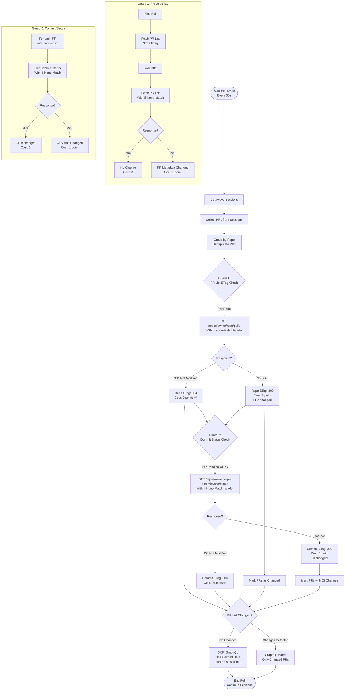
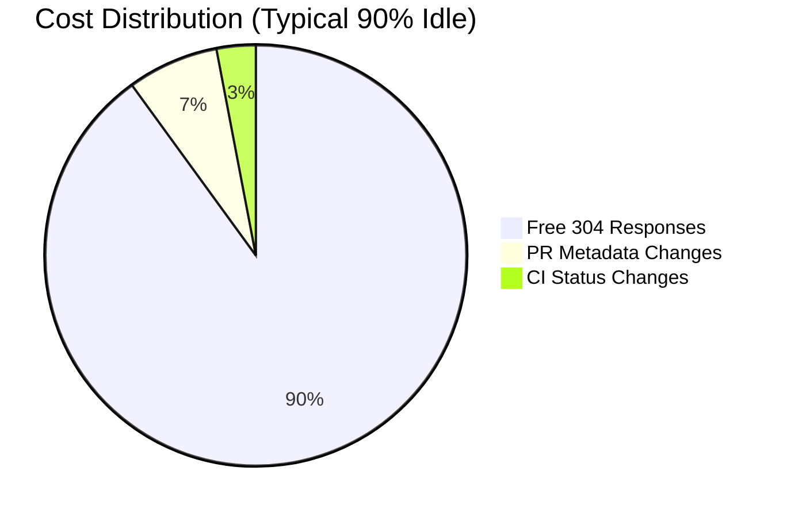
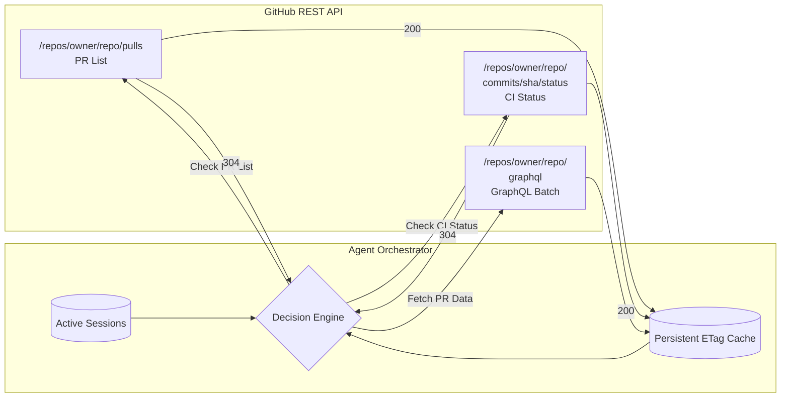
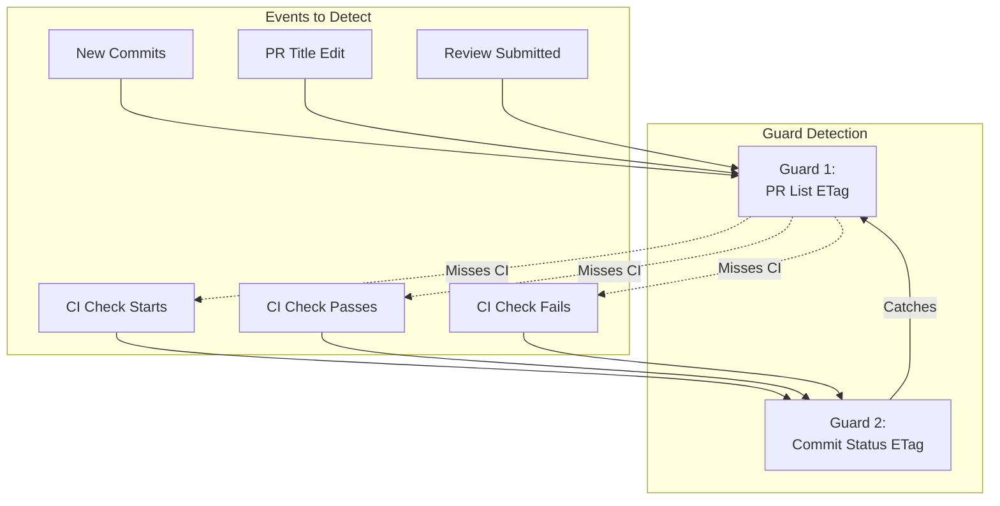

# ETag Strategy - Mermaid Dataflow Diagram



## Combined Decision Table

```mermaid
graph LR
    subgraph Decision["Decision Logic"]
        D1[Guard 1:<br/>PR List ETag]
        D2[Guard 2:<br/>Commit Status ETag]

        D1 -->|Result|
        D2 -->|Result|

        subgraph Results["Outcomes"]
            R1[Both 304]
            R2[PR 200]
            R3[CI 200]
            R4[Any 200]
        end

        |Result| --> R1
        |Result| --> R2
        |Result| --> R3
        |Result| --> R4

        subgraph Actions["Actions"]
            A1[Skip GraphQL<br/>Cost: 0 points ✅]
            A2[GraphQL Batch PRs<br/>Cost: ~10-50 points]
        end

        R1 --> A1
        R2 --> A2
        R3 --> A2
        R4 --> A2
    end
```

## Cost Flow per Poll Cycle



## Architecture Overview



## Example Timeline: 4 Poll Cycles

```mermaid
gantt
    title ETag Strategy Poll Cycles (10 Sessions)
    dateFormat X
    axisFormat %s

    section Poll 1 (30s)
    Initial      :done, init1, 30s, GraphQL Batch (10 PRs) :50 pts

    section Poll 2 (60s)
    Guard1       :done, g1, 5 REST calls, All 304 :0 pts
    Guard2       :done, g2, 1 REST call, 304 :0 pts
    Decision     :crit, d1, SKIP GraphQL :0 pts

    section Poll 3 (90s)
    Guard1       :done, g1, 5 REST calls, All 304 :0 pts
    Guard2       :done, g2, 1 REST call, 200 :1 pts
    Decision     :crit, d2, GraphQL Batch (1 PR) :10 pts

    section Poll 4-12 (120-360s)
    Quiet        :active, q, 36 REST calls, All 304 :0 pts each
```

## Guard Coverage Matrix


